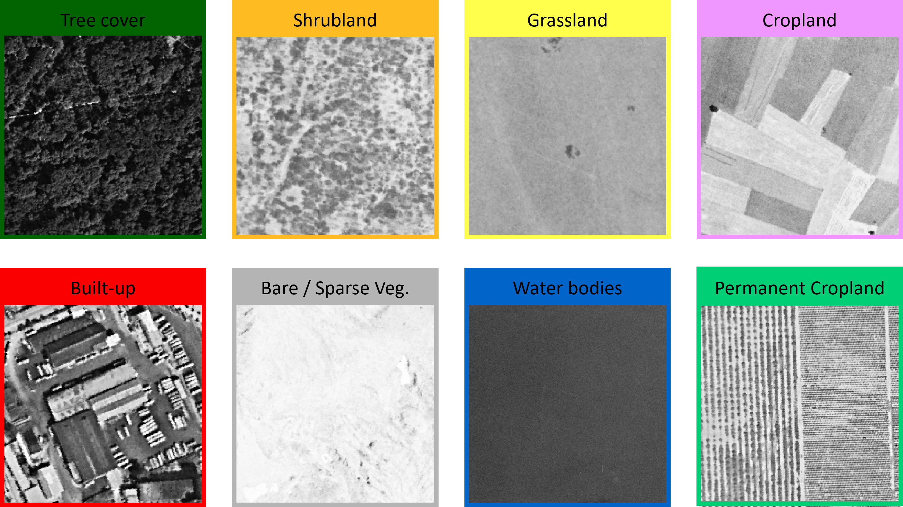
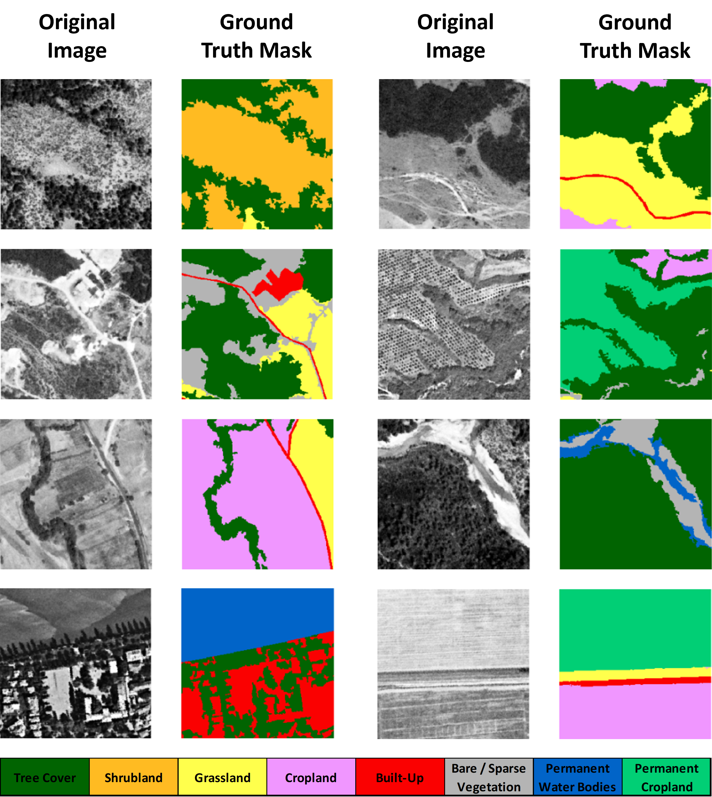

# HexaLCSeg: Hexagon-based Historical Land Cover Benchmark Dataset

This study aims to emphasize the importance of historical land cover maps and introduce a new benchmark dataset derived from very high-resolution historical Hexagon (KH-9) reconnaissance satellite images for use in deep learning-based image segmentation tasks. Our HexaLCSeg dataset comprises high-resolution monochromatic Hexagon images from the 1970s and 1980s covering Turkish and Bulgarian territories, encompassing a large geographic area

The dataset, related source code, and pre-trained models are available below.

Land Cover (LC) Classes Used In This Study
----------------------

Our dataset is inspired by the European Space Agency (ESA) WorldCover project and includes eight LC classes and related RGB codes were set for each class but we adjusted the 0-pixel value as no data and replaced the 0 values with 1 in the ESA RGB code palette.
Additionally, a new sub-class for the trees, named Permanent Cropland is defined and its RGB code was set to 1-207-117. This class is important to differentiate permanent fruit trees from other trees, specifically crucial for past agricultural mapping purposes.

 

Dataset
---------------------

The HexaLCSeg dataset comprises eight panchromatic images accompanied by corresponding 3-channel RGB Ground Truth Masks, all with 8-bit radiometric resolution and a spatial resolution of 1 meter. The dataset is organized into a total of 10,000 patches, each sized at 256x256 pixels. 
We split our dataset into 70% training (7000 patches), 15% validation (1500 patches), and 15% testing (1500 patches). Samples of our dataset are below.

***The dataset can be found [here](https://drive.google.com/drive/folders/1AFr_BmqigvoyIRBMMseiTRDteJY1Jr2C?usp=sharing).***

Methodology
---------------------
In our study, we employed the geographic object-based image analysis (GEOBIA) approach to generate accurate land cover (LC) maps, which serve as the ground truth masks for our dataset. 

For deep learning-based image segmentation, we employed a total of 9 CNN models, implementing U-Net++ and DeepLabv3+ segmentation architectures with different hyperparameters, paired with SE-ResNeXt50 backbone that pre-trained with weight values from the 2012 ILSVRC ImageNet dataset.

Models, Metric Results and Weights
---------------------

| Model No          | Architecture | Loss Function |      Augmentation      | Loss   | Accuracy | IoU    | F-1 Score | Precision | Recall  
|:-----------------:|:------------:|:-------------:|:----------------------:|:------:|:--------:|:------:|:---------:|:---------:|:-------:|
| Model 1           |   U-Net++    |  Focal Loss   |    No Augmentation     | 0.1252 |  0.9734  | 0.8052 |   0.8804  |   0.8805  | 0.8803  | 
| Model 2           |   U-Net++    |  Focal Loss   |    Horizontal Flip     | 0.1253 |  0.9728  | 0.8008 |   0.8776  |   0.8778  | 0.8774  | 
| Model 3           | DeepLabv3+   |  Focal Loss   |    No Augmentation     | 0.1255 |  0.9720  | 0.7959 |   0.8739  |   0.8744  | 0.8734  | 
| Model 4           |   U-Net++    |  Focal Loss   |    Random BC           | 0.1256 |  0.9717  | 0.7938 |   0.8725  |   0.8727  | 0.8723  | 
| Model 5           | DeepLabv3+   |   Dice Loss   |    Horizontal Flip     | 0.1292 |  0.9714  | 0.7928 |   0.8714  |   0.8717  | 0.8711  | 
| Model 6           | DeepLabv3+   |   Dice Loss   |    No Augmentation     | 0.1307 |  0.9711  | 0.7906 |   0.8699  |   0.8702  | 0.8697  | 
| Model 7           | DeepLabv3+   |   Focal Loss  |    Horizontal Flip     | 0.1257 |  0.9711  | 0.7897 |   0.8698  |   0.8704  | 0.8692  | 
| Model 8           | DeepLabv3+   |   Focal Loss  |    Random BC           | 0.1259 |  0.9704  | 0.7871 |   0.8667  |   0.8673  | 0.8662  | 
| Model 9           | DeepLabv3+   |   Dice Loss   |    Random BC           | 0.1401 |  0.9691  | 0.7793 |   0.8608  |  0.8612   | 0.8604  | 

***The pre-trained models and weights can be found [here](https://drive.google.com/drive/folders/1ujpK2IrRCaANYtHfgHqpzk-kIK55Hmit?usp=drive_link).***

Sample Outputs
---------------------
**Original images, ground truth masks and prediction masks of our 5 best models are below.**

System-specific notes and configuration
---------------------
The code was implemented in Python (3.10) Programming Language.

 - torch == 2.1.2
 - segmentation-models-pytorch == 0.3.3
 - Albumentations == 1.4.0

Apart from main data science libraries, RS-specific libraries such as GDAL, rasterio, and tifffile are also required.

Citation
---------------------
Please kindly cite our paper if this code and the dataset used in the study are useful for your research.

Sertel, E., Kabadayı, M.E, Sengul, G. S. & Tumer, I. N, (2024). HexaLCSeg: A Historical Benchmark Dataset from Hexagon Satellite Images for Land Cover Segmentation, IEEE Geoscience and Remote Sensing Magazine, Accepted.

